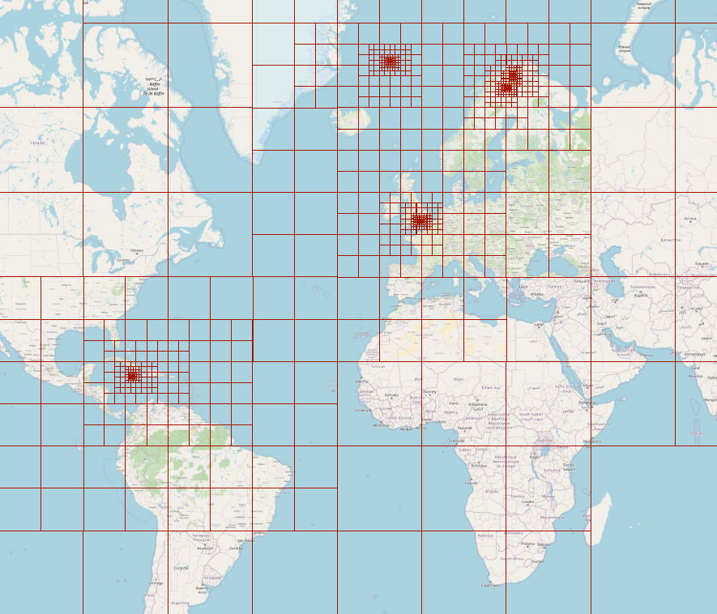

Try Here: https://rpehkone.github.io/minimal-map-tile-renderer/

map raster tile rendered  
holds state with quadtree  
exponential zoom  

Entire Earth raster tiles is over 400tb  
Entire Earth vector tiles is about 85gb  

it might be faster to render like i do here (html image elements),  
    instead of uploading gl texture like mapbox and maplibre  
vector tile renderers upload to vram with glBufferData() etc.  

  
